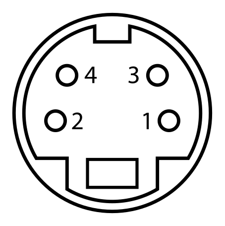

# opel-tid-display-reader
Receives display data from select Kenwood and Opel car receivers.

## Supported MCUs
Used microcontroller has to support 5V logic, otherwise logic level shifter is required.
There's some AVR I2C registers manipulation to switch between hardware I2C slave control and manual SDA line control (as required by the protocol). Thus, it's only compatible with certain microcontrollers - I have succesfully ran this on Atmega328p @ 16MHz/5V.

## Supported car stereos
I have only tested this on Kenwood KDC-BT8044U with external display interface, but it should work with other supported Kenwood and Opel receivers supporting TID protocol as well (not newer units with CAN!).

There's a list of potentially supported Kenwood radios on Polish Vectra Klub forum: https://forum.vectraklub.pl/topic/180954-poradaradia-kompatybilne-z-vectr%C4%85-bmonta%C5%BC-kenwood/

Copy for archival purposes:
```
• DPX303, DPX501U, DPX701U
• KDC-6021, KDC-M6021G, KDC-6024, KDC-M6024/G, KDC-8070R, KDC-8070W, KDC-W6027, KDC-WV6027, KDC-W6031, KDC-MV6521, KDC-V6524, KDC-W6527, KDC-W6527SE, KDC-W6531, KDC-W6534U
• KDC-7024, KDC-M7024, KDC-7027, KDC-W7027, KDC-W7031, KDC-W7041U, KDC-W7044U, KDC-W707, KDC-W7031, KDC-W7531, KDC-W7534U, KDC-W7537U, KDC-W7541U, KDC-W8531, KDC-W7544U
• KDC-8021, KDC-8024, KDC-W8027, KDC-BT8041U, KDC-BT8044U, KDC-W808, KDC-8531, KDC-W8534
• KDC-M9021, KDC-W9027, KDC-M907, KDC-PSW9521, KDC-PSW9524, KDC-PSW9527, KDC-PSW9531, KDC-W9537U
• KDV-5234
• KMD-6527, KMD-PS970R
• KRC-877R
• Z638, Z738, Z838W
```

Currently supports only DIGIT8 mode, I don't have any DIGIT10 radio at hand for testing.

## Wiring:
Radio side, as seen looking at the socket in the radio:

```
1 - SCL
2 - MRQ
3 - SDA
4 - steering wheel control (not used here)
```

MCU side (Arduino pin numbering):
```
A4 - SDA (add 4.7k pull up resistor to 5V)
A5 - SCL (add 4.7k pull up resistor to 5V)
D2 - MRQ
```

## Extras:
* [extras/TROJKA.sr]() - sigrok session dump with two full frames recorded
* [extras/Tid-protokoll.pdf]() - mirror for pdf with TID protocol description (source: [https://wiki.carluccio.de/images/7/7a/Tid-protokoll.pdf]())
